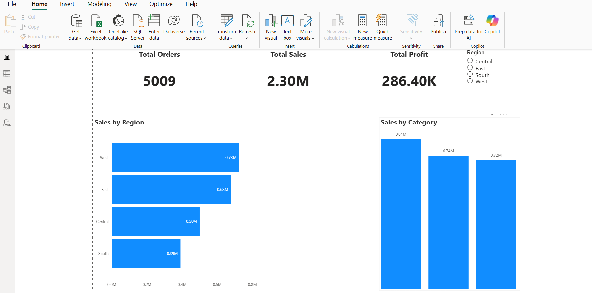

# 📊 Sales Performance Dashboard (Power BI)

## 🚀 Overview
This project is a Power BI dashboard built to analyze sales performance across regions and categories.

## 📈 Key Metrics
- Total Orders: 5009
- Total Sales: 2.30M
- Total Profit: 286.40K

## 📊 Features
- Region-wise Sales Analysis
- Category-wise Sales Performance
- Interactive Slicer (Region filter)
- Clean and professional dashboard design

## 🛠 Tools Used
- Power BI
- Excel / CSV Dataset
- Data Cleaning
- Data Visualization

## 📷 Dashboard Preview

## 💡 Insights
- West region has highest sales performance
- South region contributes least sales
- Technology category generates highest revenue

## 👨‍💻 Author
Deepak Pandey
